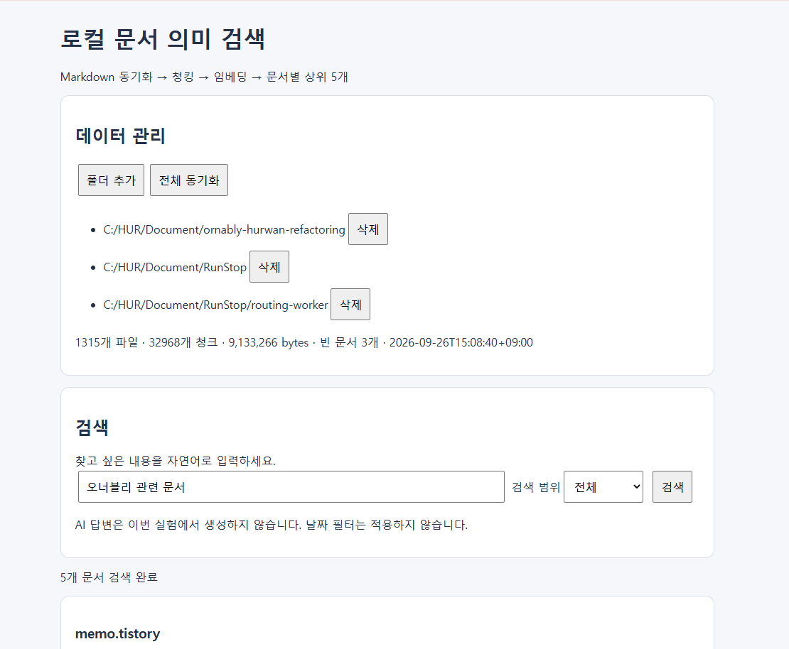
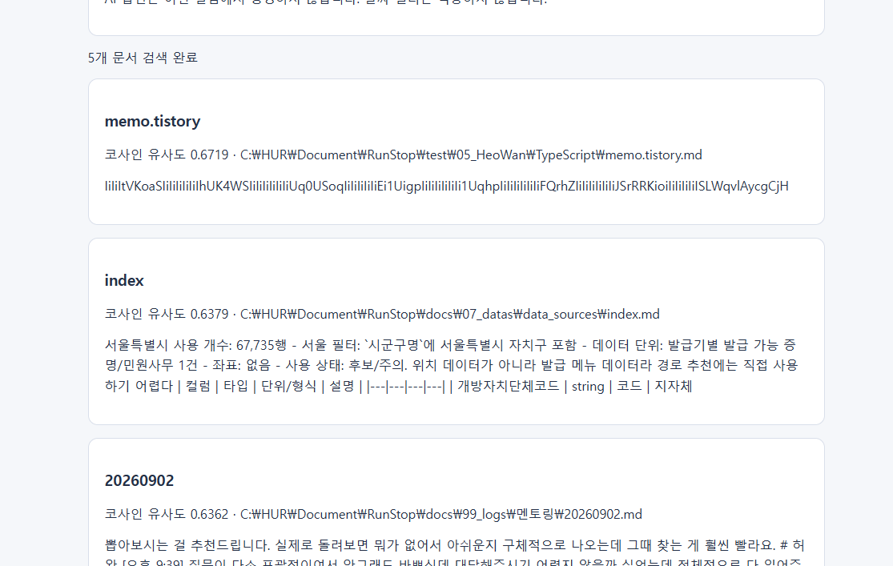
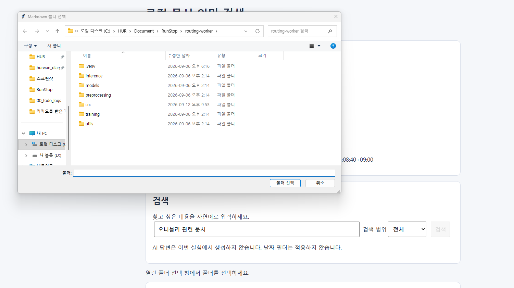

# 동기화부터 top-k 까지
`2026-09-26 12:40:52`
## 확인하려는 내용
로컬 마크다운 문서를 의미 기반으로 검색이 가능한지 테스트


이번 테스트에서는 `로컬 폴더` 하나로부터
1. 내부의 대상 파일들에 대한 읽기
2. 포맷 규격화
3. 임베딩
4. 청킹
5. 임베딩
6. 저장
7. 사용자의 프롬프트 요청
8. 요청 임베딩
9. 유사도 검색
10. top-k 추출
11. 사용자 제공

까지 한 흐름을 테스트해볼 예정입니다.

간단하게 요약하면

```
로컬 문서를 읽고 사용자의 요청을 받아서 요청에 맞는 문서를 바탕으로 추천 가능하다
```

를 검증하는 과정입니다.

---

## 파이프라인
> 해당 섹션에서는 데이터의 흐름을 나타냅니다. 파이프라인은 총 3개가 존재합니다.
### 동기화 대상 등록
> 동기화의 대상이 될 폴더를 지정합니다. 
1. UI: 사용자가 파일 탐색을 통해 검색 대상이 될 폴더를 추가할 수 있습니다. 문자열을 직접 입력하지 않고 버튼을 통해 파일 탐색기에서 UI를 통해 제공해줍니다. 추가된 폴더 경로는 데이터 페이지에서 케밥메뉴 버튼을 이용해서 관리버튼을 통해 등록된 폴더 경로를 관리할 수 있다. 등록된 경로들은 프론트의 로컬스토리지에 저장되어 관리된다. (프로토타입)
2. 프로그램 동작: 내부적으로 추가적인 로직은 존재하지 않습니다.

### 문서 동기화
> 문서 동기화 버튼을 눌렀을 때 등록해놓은 경로들을 대상으로 재귀 탐색을 통해 지정한 포맷의 이름을 가진 파일들을 가져옵니다.
1. UI: 데이터 전체 동기화 또는 로컬 폴더 동기화 버튼을 이용하여 내부 폴더에 존재하는 모든 `*.md` 파일을 가져와 프로그램 내부에 저장하게 됩니다. 
2. 프로그램 동작저장할 경우, 가져온 문서를 청킹을 한 뒤, chunking을 하여 임베딩을 합니다. 모든 임베딩은 자신의 chunk, 원본 문서에 대한 식별자를 가지고 있어야합니다.
3. UI: 프로그램에서 저장이 완료된 경우 최종 동기화 날짜와 파일개수, 크기를 업데이트 해줘 사용자에게 보여줍니다.

### 사용자 요청 입력
> 사용자가 자연어 검색 요청을 하면 검색을 통해 저장되어있는 문서 임베딩을 통해 적절한 문서의 데이터를 llm과 원본 문서를 통해 사용자에게 제공해줍니다.
1. 사용자의 요청과 검색 범위 (전체, 티스토리, 깃, ... 이지만 현재는 전체와 로컬 폴더만 존재합니다.), 생성 날짜 범위를 선택할 수 있게 합니다. 선택 범위는 구체적으로 선택하지 못하고 `전체`, `1개월`, `3개월`, `6개월`, `1년`, `3년`, `5년` 까지 존재합니다.
2. 사용자가 입력을 하면 먼저 필터링된 chunk 임베딩들이 가져와지며 chunk들을 document로 변환하여 나열한 후 중복된 document의 경우에는 상위 document 하나만을 제외하고 제거해줍니다. 이후 top-5를 사용자게에 제공해줍니다.
3. UI: 조회된 문서 5개를 사용자에게 보여줍니다. 여기에서 AI 응답은 우선 작성되지 않고 생성되지 않았다는 UI만을 제공해줍니다.

### 최종 정리
```
# 데이터
Local Folder
↓
Local Loader
↓
Document[]
↓
Chunker
↓
Chunk
↓
Embedder

# 질의
Query
↓
Embedder
↓
Query Embedding
↓
Similarity with Document Embedding
↓
Top-5 Search Hit
```

## 제외할 요소
- 데이터베이스 저장
- LLM
- 영구 저장
- 날짜 Filter
- Threshold
- Notion
- Github
- Tistory
- .exe
- Citation UI (출처 제공)

## 종료 조건
- 동기화 버튼을 눌렀을 때 결과가 UI에 잘 제공되고 임베딩이 잘 되는지
- 질문을 하였을 때 동기화된 문서들과 유사한 문서들이 잘 나오는지


# 프로그램 리뷰
`2026-09-26 15:20:30`







직접 실행해보기도 하고 코드를 보기도 했는데 제가 보기에는 큰 문제가 없어 보였습니다.
sentence-transformer 모델을 사용하고 max_sequene_length 가 128이였는데 벡터화도 잘 되는 느낌이고 예외 처리도 잘 되어있던 것 같습니다.

`os.walk`에서 `error` 때문에 `.cache` 같은 폴더를 읽으려다 에러가 났던 점과 cpu를 사용하여 모델을 사용할 때 생각보다 오래 걸린 부분을 제외하면 고내찮았습ㄴ디ㅏ.

10MB, 1300개 파일이라서 더 오래걸렸나 싶습니다. 하지만 결정적으로 검색시에 유사한 문서가 나오지 않습니다. 일단 코드를 직접 공부해보면서 이해해보고 튜닝할 생각을 해보면 좋을 것 같습니다.

이제 해결하거나 분석할만한 부분은 다음과 같습니다
- cpu 코드를 cuda 제공 시 cuda 사용으로
- 진행률을 로그로 보여주는 형식으로
- 모델을 한번 뜯어보고 어떤 모델인지 확인해보기
- chunk 데이터를 서버의 파일로 쌓을 수 있게 만들어놓기 (현재는 메모리에 적재하는 방식)
- 검색엔진 개선
- 만들어진 패턴 분석